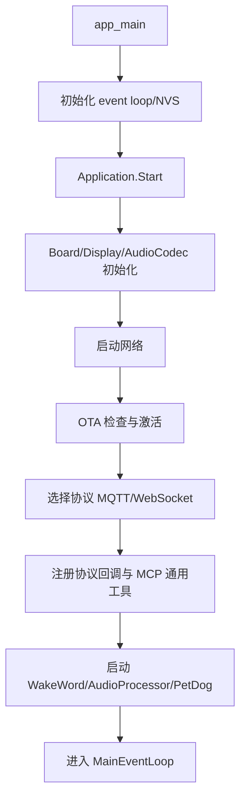
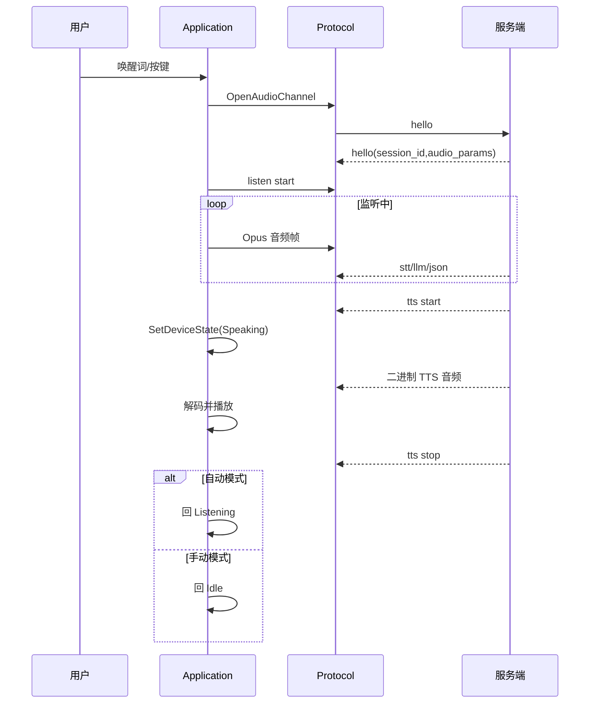

# Doro Robot 开发文档

本文档面向新加入项目的开发者，目标是快速建立对系统核心机制的完整认知。

- 代码基线：ESP-IDF + FreeRTOS（`main/` 为核心业务）
- 核心入口：`main/main.cc`
- 核心控制器：`main/application.cc`
- 协议栈：`main/protocols/`
- MCP 服务端：`main/mcp_server.cc`

## 1. 核心设计思路

### 1.1 架构分层

项目采用“设备编排层 + 协议层 + 硬件抽象层”的结构：

- 设备编排层（`Application`）
: 管理设备状态机、音频流水线、唤醒词、显示/LED、动作控制与 OTA 流程。
- 协议层（`Protocol` 抽象 + `WebsocketProtocol`/`MqttProtocol`）
: 统一上层调用接口，将控制消息与音频流通过不同传输实现发送到服务端。
- MCP 服务层（`McpServer`）
: 在设备侧实现 MCP JSON-RPC 解析、工具注册与工具执行。
- 业务与设备能力层（Board/Display/AudioCodec/PetDog/ThingManager）
: 提供硬件能力和业务动作能力。

### 1.2 并发与任务模型

核心线程/任务分工如下：

- `app_main` 所在线程
: 初始化系统后进入 `Application::Start()`。
- `Application::MainEventLoop()`
: 主串行控制循环，负责执行调度任务与发送音频队列。
- `Application::AudioLoop()`
: 高频循环，负责麦克风输入和扬声器输出。
- `BackgroundTask`
: 后台任务队列，执行编码、解码等耗时任务，避免阻塞主流程。
- `PetDog::ActionTask()`
: 轮询动作状态并触发步态任务。

设计关键点：

- 状态/界面切换优先通过 `Schedule()` 回到主事件循环串行执行，降低竞态风险。
- 音频编解码放入 `BackgroundTask`，把实时性更强的输入/输出轮询从重计算中解耦。

## 2. 启动与初始化流程

### 2.1 启动主链路



### 2.2 协议选择策略

`Application::Start()` 中根据 OTA 下发配置决策：

- 存在 MQTT 配置 -> `MqttProtocol`
- 否则存在 WebSocket 配置 -> `WebsocketProtocol`
- 否则回退 MQTT

这保证“服务端可远程下发通信参数，设备无须重新固件即可切换传输方案”。

## 3. 通信协议详解

## 3.1 上层统一消息模型

设备侧统一通过 `Protocol` 发送以下消息类型：

- `listen`：开始/停止监听、唤醒词检测通知
- `abort`：中断当前播报
- `iot`：IoT 描述/状态
- `mcp`：MCP JSON-RPC 负载
- 二进制音频帧：Opus 编码后的音频包

## 3.2 WebSocket 协议（控制 + 音频同链路）

握手流程：

1. `OpenAudioChannel()` 建立 WS 连接，设置请求头（Authorization/Protocol-Version/Device-Id/Client-Id）
2. 设备发送 `hello`（包含 `features` 与 `audio_params`）
3. 等待服务端 `hello`，解析 `session_id` 与服务端音频参数
4. 握手成功后进入会话

音频帧封装：

- `version=2`：使用 `BinaryProtocol2`（含 timestamp）
- `version=3`：使用 `BinaryProtocol3`
- 其他：直接发送裸 Opus

## 3.3 MQTT + UDP 协议（控制与媒体分离）

控制面：MQTT；媒体面：UDP（AES-CTR 加密）。

握手流程：

1. 通过 MQTT 发送 `hello`（`transport=udp`）
2. 服务端返回 `udp.server/udp.port/udp.key/udp.nonce`
3. 建立 UDP 通道
4. 音频包以 nonce + AES-CTR 加密 payload 方式收发

顺序保护：

- UDP 包含 sequence 字段
- 设备侧会检查旧序列并告警乱序，降低重放/乱序对音频体验影响

## 3.4 MCP 协议（JSON-RPC 2.0）

MCP 在本项目中作为 `type: "mcp"` 的 payload 承载 JSON-RPC：

- `initialize`
: 初始化会话并可下发能力（例如视觉服务 URL/token）
- `tools/list`
: 获取工具清单，支持 cursor 分页
- `tools/call`
: 调用工具并返回结果

设备端实现特性：

- 先进行 JSON-RPC 严格校验（版本、method、params、id）
- `notifications/*` 不回包
- 工具调用运行在独立线程，避免阻塞解析线程
- 参数类型与范围在 `Property`/`PropertyList` 处进行校验

## 4. 数据流图与时序说明

### 4.1 语音会话数据流

```mermaid
flowchart LR
    Mic[麦克风输入] --> A[AudioLoop::OnAudioInput]
    A --> B[WakeWord Feed 或 AudioProcessor Feed]
    B --> C[Opus Encode BackgroundTask]
    C --> D[audio_send_queue]
    D --> E[MainEventLoop SEND_AUDIO_EVENT]
    E --> F[Protocol::SendAudio]
    F --> G[Server]

    G --> H[Protocol OnIncomingAudio]
    H --> I[audio_decode_queue]
    I --> J[OnAudioOutput + Opus Decode]
    J --> K[AudioCodec 输出]
```



关键机制：

- 发送方向：编码后进入发送队列，再由主事件循环统一发送。
- 接收方向：协议回调写入解码队列，输出环路按节奏消费，避免爆发式阻塞。

### 4.2 典型对话时序（唤醒到播报）



## 5. 关键业务执行流程分解

### 5.1 设备状态机流转

主要状态：

- `Starting`
- `WifiConfiguring`
- `Activating`
- `Idle`
- `Connecting`
- `Listening`
- `Speaking`
- `Upgrading`
- `AudioTesting`
- `FatalError`

核心规则：

- 切换到 `Listening` 时，启动音频处理并发送 `listen start`。
- 切换到 `Speaking` 时，重置解码器并根据模式决定是否继续唤醒检测。
- 进入新状态前会等待后台任务收敛，避免状态切换瞬间出现“旧任务写新状态”的混乱。

### 5.2 TTS 中断与打断

触发点：

- 唤醒词在播报中触发
- 用户主动中断

执行逻辑：

1. `AbortSpeaking(reason)` 发送 `abort`
2. 标记 `aborted_ = true`
3. 解码回调收到后停止后续播放
4. 依据监听模式进入下一状态（`Listening` 或 `Idle`）

### 5.3 OTA 激活与升级

流程拆解：

1. `CheckVersion()` 请求 OTA 服务
2. 解析 `activation/mqtt/websocket/server_time/firmware`
3. 如有激活挑战，调用 `Activate()`（可含 HMAC 计算）
4. 如有新固件，执行 `Upgrade()` 分片下载并 `esp_ota_write`
5. `esp_ota_end + esp_ota_set_boot_partition` 后重启

可靠性策略：

- 失败重试与指数退避
- 升级前关闭音频相关通道并等待后台任务完成
- 启动后调用 `MarkCurrentVersionValid()` 处理回滚状态

### 5.4 机器人动作执行链路

```mermaid
flowchart TD
    A[Application::SetActionState] --> B[action_event_group_ 置位]
    B --> C[PetDog::ActionTask 轮询]
    C --> D[PetDog::Action(action_state)]
    D --> E[创建对应动作任务]
    E --> F[步态循环执行]
    F --> G[检测 STOP_TASK_EVENT 协作终止]
```

动作系统设计要点：

- 长动作（walk/turn）在独立任务运行，避免阻塞上层逻辑。
- 停止逻辑采用事件位协作退出，而非强制 kill 任务。

## 6. 关键源码导读建议

建议阅读顺序：

1. `main/main.cc`
2. `main/application.h`
3. `main/application.cc`
4. `main/protocols/protocol.h`
5. `main/protocols/websocket_protocol.cc`
6. `main/protocols/mqtt_protocol.cc`
7. `main/mcp_server.h`
8. `main/mcp_server.cc`
9. `main/ota.cc`
10. `main/pet_dog.cc`

## 7. 开发与维护建议

- 新增业务能力时，优先通过 `Schedule()` 回到主循环做状态变更。
- 新增耗时计算时，优先复用 `BackgroundTask`，避免占用音频实时路径。
- MCP 工具参数必须定义类型、默认值与范围，降低服务端误调用风险。
- 协议字段变更时需同时更新：设备 `hello` + 服务端解析 + 文档。

## 8. 术语对照

- AEC：Acoustic Echo Cancellation，回声消除
- VAD：Voice Activity Detection，语音活动检测
- MCP：Model Context Protocol
- Control Plane：控制面（JSON 指令）
- Media Plane：媒体面（音频流）
