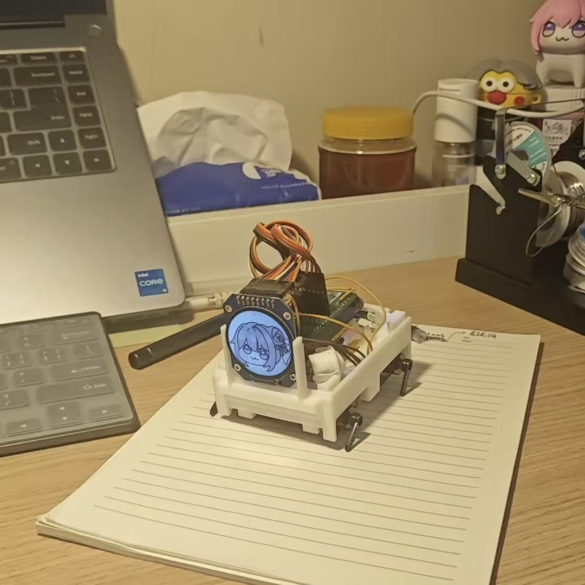

# 🐾 Doro Robot — 基于小智 ESP32 的 AI 机械狗 & 智能家居控制系统

> 🔗 **本项目基于开源项目 [xiaozhi-esp32](https://github.com/78/xiaozhi-esp32) 二次开发，感谢原作者 [@78 (Xiaoxia)](https://github.com/78) 的杰出开源作品！**
>
> 原项目是一个运行在 ESP32 上的 AI 聊天机器人，支持语音唤醒、实时对话和 IoT 控制。本项目在此基础上**新增了四足机械狗运动控制和基于 MQTT 协议的远程家居设备控制**功能。

---

## 📸 项目成果展示

| 机械狗实物 | 运动控制演示 | 家居控制演示 |
|:---:|:---:|:---:|
|  |  |  |


---

## ✨ 新增功能亮点

### 🦾 四足机械狗运动控制

通过 4 路 PWM 舵机驱动（LEDC 50Hz），实现 **14 种动作姿态**，支持 AI 语音指令或远程 IoT 调用：

| 动作 | 描述 | 动作 | 描述 |
|------|------|------|------|
| 前进 | 持续向前行走 | 后退 | 持续向后行走 |
| 前进四步 | 前进 4 步后停止 | 立正 | 四足站立姿态 |
| 坐下 | 后腿弯曲坐姿 | 睡觉 | 趴卧休眠姿态 |
| 持续左转 | 原地持续左旋 | 持续右转 | 原地持续右旋 |
| 左转 90° | 左转 90° 后停止 | 右转 90° | 右转 90° 后停止 |
| 招手 (你好/再见) | 前腿挥动手势 | 展示才艺 | 前后摇摆舞蹈 |
| 随机待机动作 | 空闲时随机小动作 | 停止 | 立即停止当前动作 |

**舵机 GPIO 接线：**

| 舵机位置 | GPIO 引脚 | LEDC 通道 |
|----------|-----------|-----------|
| 右后腿   | GPIO 14   | Channel 0 |
| 左前腿   | GPIO 18   | Channel 1 |
| 右前腿   | GPIO 13   | Channel 2 |
| 左后腿   | GPIO 17   | Channel 3 |

### 🏠 MQTT 远程家居设备控制

通过 MQTT 协议（EMQX 公共 Broker）远程控制家中的智能设备，由 ESP32 作为中控，AI 语音下达指令即可操控：

- **💡 智能灯控制 (LightMqtt)**
  - MQTT Topic: `syj_connect_esp01s_light_topic`
  - 支持操作：开灯 / 关灯 / 设置状态
  - 实时状态同步反馈

- **🌀 智能风扇控制 (FanMqtt)**
  - MQTT Topic: `syj_connect_esp01s_fan_topic`
  - 支持操作：开启 / 关闭 / 设置状态
  - 实时状态同步反馈

末端设备（灯、风扇等）通过 ESP-01S 等模块接入 MQTT Broker，Doro Robot 主控通过语音 → AI → IoT 指令链路实现跨设备控制。

---

## 🏗️ 系统架构

```
┌────────────────────────────────────────────────────────────────┐
│                      语音 / AI 交互层                          │
│          唤醒词检测 → 语音识别 → AI 对话 → 指令解析              │
├────────────────────────────────────────────────────────────────┤
│                      设备编排层 (Application)                   │
│      状态机管理 · 音频流水线 · 动作控制 · OTA · 显示/LED         │
├──────────────────┬────────────────────┬───────────────────────┤
│   协议层          │   MCP 服务层       │   IoT 物模型层         │
│ WebSocket/MQTT   │ JSON-RPC 2.0      │ ThingManager          │
│ + UDP 音频       │ 工具注册与调用      │ 设备注册/发现/调用     │
├──────────────────┴────────────────────┴───────────────────────┤
│                    硬件抽象层                                   │
│   Board · AudioCodec · Display · LED · PetDog · Camera        │
├────────────────────────────────────────────────────────────────┤
│              ESP-IDF + FreeRTOS (>= 5.4.0)                    │
└────────────────────────────────────────────────────────────────┘
```

### 并发任务模型

| 任务 | 职责 |
|------|------|
| `Application::MainEventLoop()` | 主串行控制循环，调度任务与发送音频 |
| `Application::AudioLoop()` | 高频循环，麦克风输入 / 扬声器输出 |
| `BackgroundTask` | 后台队列，Opus 编/解码等耗时计算 |
| `PetDog::ActionTask()` | 机械狗独立动作任务，轮询动作状态并执行步态 |
| MQTT IoT Tasks | 各 MQTT 设备独立连接与消息处理 |

---

## 📁 项目结构

```
doro_robot/
├── CMakeLists.txt                  # 项目根构建文件 (v1.7.6)
├── sdkconfig.defaults.*            # 各芯片默认配置
├── partitions/                     # Flash 分区表
├── docs/                           # 文档与图片资源
│   ├── mcp-protocol.md             # MCP 协议规范
│   ├── mcp-usage.md                # MCP 使用指南
│   └── websocket.md                # WebSocket 协议说明
├── scripts/                        # 工具脚本
│   ├── flash.sh                    # 固件烧录
│   ├── gen_lang.py                 # 多语言生成
│   └── release.py                  # 发布构建
└── main/
    ├── main.cc                     # 入口 (app_main)
    ├── application.cc/h            # 核心控制器 & 状态机
    ├── pet_dog.cc/h                # ⭐ 四足机械狗驱动 (新增)
    ├── mcp_server.cc/h             # MCP JSON-RPC 2.0 服务
    ├── ota.cc/h                    # OTA 固件升级
    ├── settings.cc/h               # NVS 持久化设置
    ├── system_info.cc/h            # 系统信息工具
    ├── iot/
    │   ├── thing.cc/h              # IoT 物模型基类
    │   ├── thing_manager.cc/h      # 物模型管理器
    │   └── things/
    │       ├── action.cc           # ⭐ 机械狗动作控制 (新增)
    │       ├── light_mqtt.cc       # ⭐ MQTT 灯控制 (新增)
    │       ├── fan_mqtt.cc         # ⭐ MQTT 风扇控制 (新增)
    │       ├── battery.cc          # 电池状态
    │       ├── speaker.cc          # 扬声器音量
    │       ├── lamp.cc             # 板载灯控制
    │       └── screen.cc          # 屏幕控制
    ├── audio_codecs/               # 音频编解码器 (ES8311/ES8388 等)
    ├── audio_processing/           # AFE 音频前端处理
    ├── boards/                     # 50+ 开发板适配
    ├── display/                    # 显示驱动 (LCD/OLED/串口)
    ├── led/                        # LED 驱动
    ├── protocols/                  # 通信协议 (WebSocket/MQTT+UDP)
    └── assets/                     # 多语言资源 (zh-CN/en-US/ja-JP/zh-TW)
```

---

## 🔧 开发环境与构建

### 前置条件

- **ESP-IDF** >= 5.4.0
- **CMake** >= 3.16
- **Python 3** (用于脚本工具)
- **支持芯片**: ESP32 / ESP32-S3 / ESP32-C3 / ESP32-C6 / ESP32-P4

### 构建步骤

```bash
# 1. 克隆项目
git clone https://github.com/<your-username>/doro_robot.git
cd doro_robot

# 2. 设置 ESP-IDF 环境
. $IDF_PATH/export.sh

# 3. 配置目标芯片 (以 ESP32-S3 为例)
idf.py set-target esp32s3

# 4. 配置选项 (选择开发板、语言等)
idf.py menuconfig
# → Xiaozhi Assistant → Board Type → 选择你的开发板
# → Xiaozhi Assistant → Language → 选择语言

# 5. 编译
idf.py build

# 6. 烧录
idf.py -p /dev/ttyUSB0 flash monitor
```

### 关键配置项 (menuconfig)

| 配置项 | 说明 |
|--------|------|
| `BOARD_TYPE_*` | 开发板型号选择（50+ 可选） |
| `LANGUAGE_*` | 界面语言 (zh-CN / zh-TW / en-US / ja-JP) |
| `USE_AUDIO_PROCESSOR` | AFE 音频处理（回声消除/降噪） |
| `USE_AFE_WAKE_WORD` | 唤醒词引擎选择 |
| `IOT_PROTOCOL_*` | IoT 通信协议配置 |

---

## 📡 通信协议

项目支持两种服务端通信方式：

### WebSocket 协议
- 控制消息与音频流共用同一链路
- 支持 Opus 音频二进制帧 (BinaryProtocol2/3)
- 10 秒会话超时自动断开

### MQTT + UDP 协议
- **控制面 (MQTT)**: JSON 消息 (hello/listen/abort/iot/mcp)
- **媒体面 (UDP)**: AES-CTR 加密的 Opus 音频传输
- 序列号保护，防重放攻击

### MCP (Model Context Protocol)
- 基于 JSON-RPC 2.0 的工具发现与调用协议
- 支持设备能力自描述（工具列表、参数类型/范围）
- 详见 [MCP 协议文档](docs/mcp-protocol.md) 和 [MCP 使用指南](docs/mcp-usage.md)

---

## 🐕 机械狗控制原理

### 硬件层
- **舵机驱动**: 4 路 LEDC PWM (50Hz, 13-bit 精度)
- **角度范围**: 0°~180°（PWM 占空比 0.5ms~2.5ms）
- **运动参数**: 行走幅度 45°，转弯幅度 40°

### 软件层
- **独立 FreeRTOS 任务**: `PetDog::ActionTask()` 以事件驱动方式运行
- **协作式退出**: 通过事件组 (`START_TASK_EVENT` / `STOP_TASK_EVENT`) 实现优雅停止，避免状态损坏
- **指令链路**: 语音 → AI 解析 → IoT `Action` Thing → `Application::SetActionState()` → PetDog 执行

### 预设姿态角度

| 姿态 | 左前腿 | 右前腿 | 左后腿 | 右后腿 |
|------|--------|--------|--------|--------|
| 站立 | 90°    | 90°    | 90°    | 90°    |
| 坐下 | 90°    | 90°    | 25°    | 25°    |
| 睡眠 | 180°   | 180°   | 0°     | 0°     |

---

## 🏠 MQTT 家居控制原理

```
┌─────────┐    语音指令    ┌─────────────┐   MQTT Publish   ┌──────────────┐
│  用户    │ ──────────→  │ Doro Robot  │ ──────────────→  │ EMQX Broker  │
│ (语音)   │              │ (ESP32主控)  │                  │  (公共云)     │
└─────────┘              └─────────────┘                  └──────┬───────┘
                                                                 │ MQTT
                                                                 ▼
                                                          ┌──────────────┐
                                                          │  ESP-01S     │
                                                          │ (灯/风扇等)   │
                                                          └──────────────┘
```

- 每个家居设备注册为独立的 IoT Thing，拥有属性（状态）和方法（操作）
- MQTT 客户端在独立 FreeRTOS 任务中运行，WiFi 连接后自动启动
- 支持 Last Will 遗嘱消息，设备离线自动通知
- 状态双向同步：本地操作 → MQTT 发布，远程消息 → 状态更新

---

## 🔌 支持的开发板

项目继承了原项目的 **50+ 开发板** 适配，包括但不限于：

<details>
<summary>点击展开完整列表</summary>

**面包板 / DIY 系列**
- Bread Compact WiFi (ESP32-S3)
- Bread Compact WiFi + LCD / Camera
- Bread Compact ML307 (4G 蜂窝)
- Bread Compact ESP32 / ESP32 + LCD

**乐鑫官方**
- ESP-BOX-3 / ESP-BOX / ESP-BOX-Lite
- ESP32-S3-Korvo2-V3
- ESP-SparkBot / ESP-Spot-S3

**商用 / 社区方案**
- M5Stack CoreS3 / Tab5 / AtomS3 + Echo Base
- LilyGo T-Circle-S3 / T-CameraPlus
- Waveshare ESP32-S3 多尺寸触摸屏
- Kevin Box / Kevin C3 / Kevin SP V4
- MagiClick 系列 (2.4" / 2.5" / C3)
- DFRobot 行空板 K10 / S3-AI-Cam
- SenseCAP Watcher
- 太极派 Taiji-Pi S3
- ...

</details>

---

## 📄 相关文档

| 文档 | 说明 |
|------|------|
| [MCP 协议规范](docs/mcp-protocol.md) | MCP JSON-RPC 2.0 完整协议定义 |
| [MCP 使用指南](docs/mcp-usage.md) | 开发者快速接入 MCP 工具注册 |
| [WebSocket 协议](docs/websocket.md) | WebSocket 通信流程与消息格式 |
| [开发文档](README.develp.md) | 项目内部架构与开发指南 |

---

## 🤝 致谢

- **[xiaozhi-esp32](https://github.com/78/xiaozhi-esp32)** — 原始项目，由 [@78 (Xiaoxia)](https://github.com/78) 开发维护，提供了完整的 ESP32 AI 语音助手框架。本项目的所有基础能力（语音交互、协议栈、显示驱动、OTA 等）均来自该项目。
- **[ESP-IDF](https://github.com/espressif/esp-idf)** — 乐鑫官方 IoT 开发框架
- **[LVGL](https://lvgl.io/)** — 嵌入式 GUI 库
- **[EMQX](https://www.emqx.io/)** — MQTT Broker 服务

---

## 📜 许可证

本项目遵循 [MIT License](LICENSE)，继承自原项目 xiaozhi-esp32。

Copyright (c) 2024 Xiaoxia

---

<p align="center">
  <sub>🐾 Built with ❤️ on top of <a href="https://github.com/78/xiaozhi-esp32">xiaozhi-esp32</a></sub>
</p>
